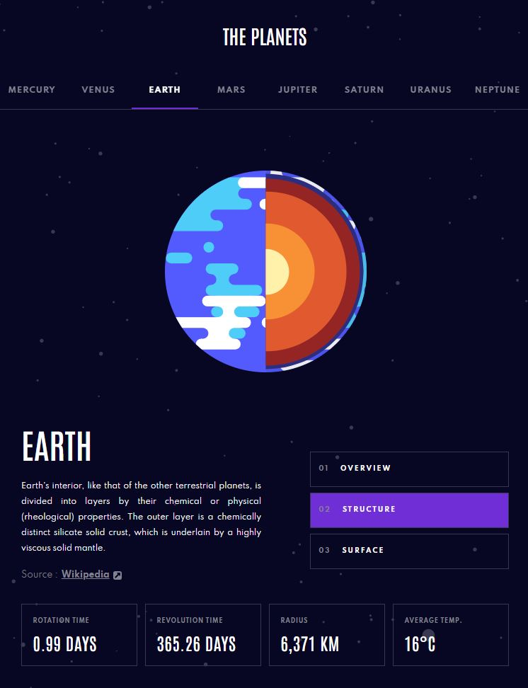

# Frontend Mentor - Planets fact site solution

This is a solution to the [Planets fact site challenge on Frontend Mentor](https://www.frontendmentor.io/challenges/planets-fact-site-gazqN8w_f). Frontend Mentor challenges help you improve your coding skills by building realistic projects. 

### The challenge

Users should be able to:

- View the optimal layout for the app depending on their device's screen size
- See hover states for all interactive elements on the page
- View each planet page and toggle between "Overview", "Internal Structure", and "Surface Geology"

### Screenshot - desktop

### Screenshot - tablet

### Screenshot - mobile

### Links

- Solution URL: [solution URL](https://github.com/DavidIrvine-TW/the-planets)
- Live Site URL: [live site](davidirvine-tw.github.io/the-planets/)

## Author

- Website - [DavidIrvine-TW](https://github.com/DavidIrvine-TW)
- Frontend Mentor - [DavidIrvine](https://www.frontendmentor.io/profile/DavidIrvine-TW)
